# گزارش آزمایش پنجم

## استقرار پروژه 

در ابتدا اقدام به نوشتن Dockerfile برای برنامه می‌کنیم:

 که وظیفه داکر فایل ایجاد یک دایرکتوری جدید و انتقال فایل‌های پروژه به کانتینر بالاآمده برای اجرا و همچنین نصب نیازمندی‌های مورد نیاز برنامه که در ادامه تصویر داکر فایل را مشاهده می‌کنید:

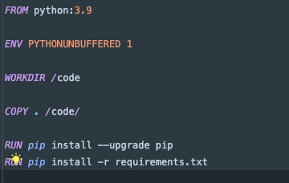

همچنین در ادامه اقدام به نوشتن docker-compose می‌کنیم:

وظیفه docker-compose بالا آوردن ۲ کانتینر که یکی مربوط به web-server جنگو است و دیگری مربوط به دیتابیس postgres است که سرویس بتواند به آن وصل شود.
که در ادامه تصویر مربوط به فایل docker-compose v را مشاهده می‌کنید:

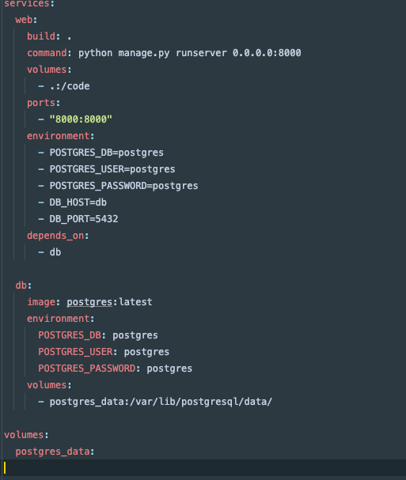

همچنین در این فایل تنظیم کرده‌ایم که وب سرور مدنظر بر روی پورت ۸۰۰۰ بالا بیاید و همچنین کانفیگ مربوط به دیتابیس را نیز در اینجا تعیین کرده‌ایم.

و کانفیگ مربوط را در مسیر notes/settings.py قرار داده‌ایم که در تصویر زیر مشاهده می‌کنید:

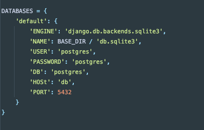

در ادامه پس از اجرای دستور docker-compose up ابتدا ایمیج‌های مربوط به python , postgres را pull می‌کند و سپس برنامه را بر روی پورت ۸۰۰۰ سیستم بالا می‌آورد.

و در ادامه داخل کانتینر مربوط به وب سرور exec می‌کنیم و دستورات migration و همچنین create superuser را وارد می‌کنیم.

که در ادامه تصاویر مربوط به وب سرور را مشاهده می‌کنید:

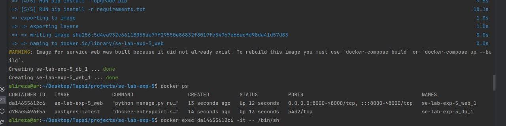

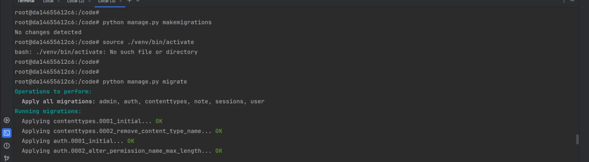

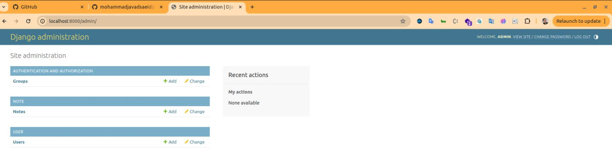

## ارسال درخواست به وب‌سرور

1. یک کاربر به نام user1 با رمز ۱۲۳۴ بسازید.
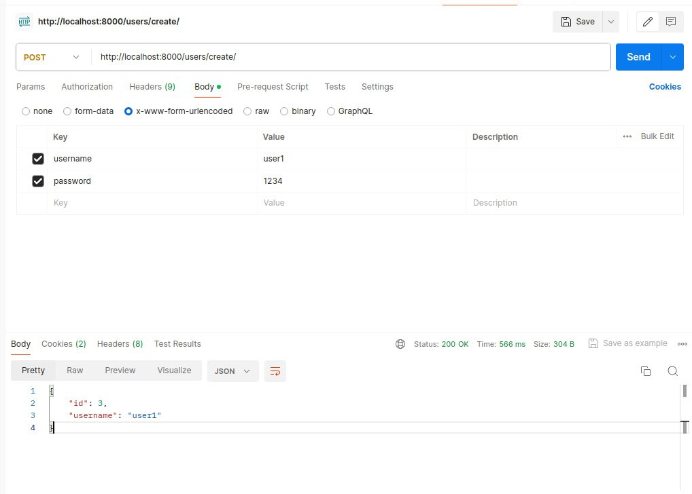
2. یادداشتی با تیتر title1 و بدنه body1 برای user1 بسازید.

3. یادداشتی با تیتر title2 و بدنه body2 برای user1 بسازید.
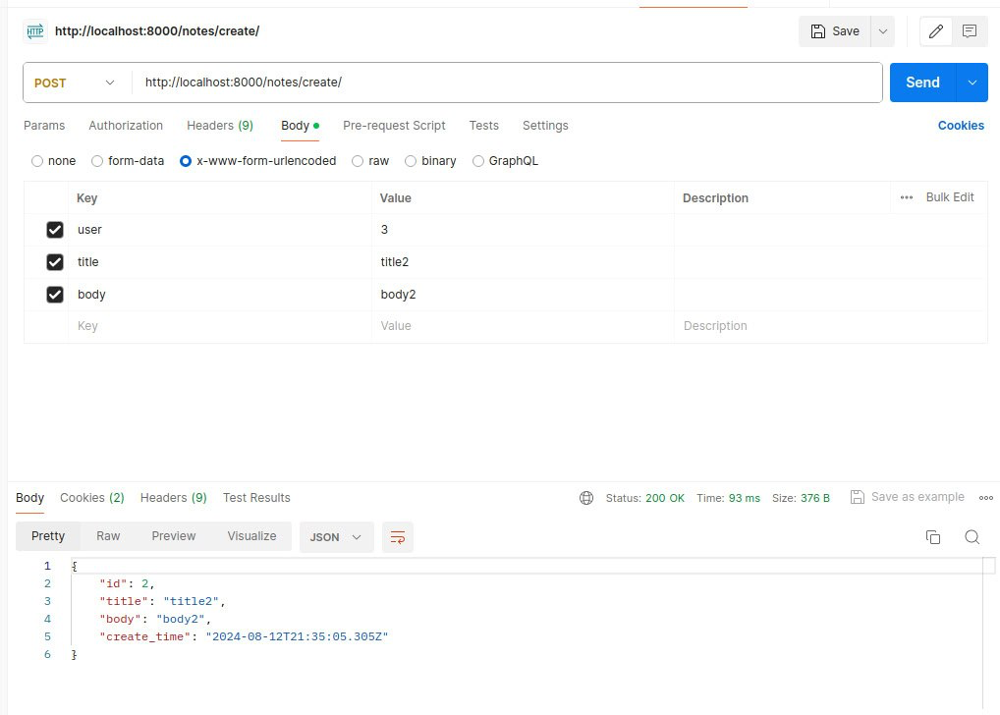
4. همه یادداشت‌های user1 را دریافت کنید. (باید ۲ یادداشت بالا را به عنوان خروجی دریافت کنید)
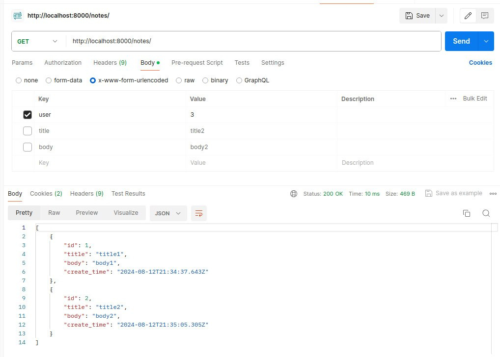

## تعامل با داکر

1. 
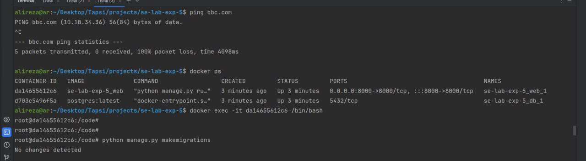

2.
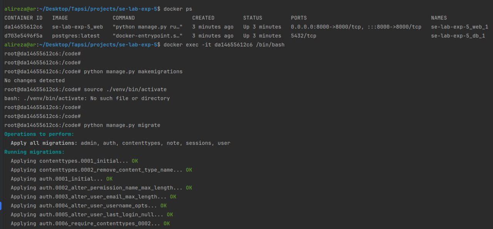

## پرسش‌ها

1. وظایف Dockerfile، image و container را توضیح دهید.

Dockerfile:

وظیفه: Dockerfile یک فایل متنی ساده است که شامل دستورات و تنظیماتی است که نحوه ساخت یک Docker Image را تعریف می‌کند. این دستورات می‌توانند شامل نصب نرم‌افزارها، تنظیم متغیرهای محیطی، کپی فایل‌ها به داخل image و مشخص کردن دستورات قابل اجرای پیش‌فرض باشند.
توضیح: Dockerfile به عنوان نقطه شروع برای ساخت image ها عمل می‌کند. شما می‌توانید Dockerfile را به عنوان یک دستورالعمل یا نقشه برای ساخت یک محیط نرم‌افزاری قابل تکرار تصور کنید. با اجرای دستورات داخل Dockerfile، یک Docker Image تولید می‌شود.

Image:

وظیفه: Docker Image یک بسته‌ای است که شامل تمام کدها، وابستگی‌ها، فایل‌ها و تنظیماتی است که برای اجرای یک برنامه نیاز دارید. Image‌ها لایه‌بندی شده و فقط خواندنی هستند.
توضیح: Image ها به عنوان الگو یا snapshot برای ایجاد کانتینرها عمل می‌کنند. از هر Docker Image می‌توان چندین کانتینر ایجاد کرد. به عبارتی، image یک نمونه ایستا (غیر قابل تغییر) از یک محیط اجرایی است که می‌تواند بارها و بارها برای ایجاد محیط‌های اجرایی مختلف (کانتینرها) استفاده شود.

Container:

وظیفه: Docker Container یک محیط اجرایی سبک و ایزوله‌شده است که بر اساس Docker Image ایجاد می‌شود. این محیط شامل تمام آنچه که برای اجرای یک برنامه لازم است، از جمله کدها، وابستگی‌ها و تنظیمات محیطی، می‌شود.
توضیح: کانتینرها نمونه‌های در حال اجرای Docker Image‌ها هستند. هر کانتینر یک فضای نام (namespace) جداگانه دارد که از سیستم فایل، شبکه و پردازش‌های سیستم‌عامل اصلی ایزوله شده است. این ایزولاسیون به برنامه‌ها اجازه می‌دهد که به صورت مجزا و بدون تأثیر بر سایر برنامه‌ها اجرا شوند.

2. از kubernetes برای انجام چه کارهایی می‌توان استفاده کرد؟ رابطه آن با داکر چیست؟

مدیریت کانتینرها: Kubernetes ابزاری برای مدیریت چرخه حیات کانتینرها است. این شامل اجرای کانتینرها، مقیاس‌گذاری آنها، خودترمیمی (self-healing) در صورت بروز مشکل و مدیریت بار روی سیستم می‌شود.

مقیاس‌گذاری خودکار (Auto-Scaling): Kubernetes می‌تواند بر اساس ترافیک یا مصرف منابع به صورت خودکار تعداد کانتینرهای اجرا شده را افزایش یا کاهش دهد.

تعادل بار (Load Balancing): Kubernetes به طور خودکار ترافیک ورودی را بین کانتینرها توزیع می‌کند، تا اطمینان حاصل شود که هیچ کانتینری بار بیش از حدی را متحمل نمی‌شود.

مدیریت انتشارها (Rolling Updates and Rollbacks): Kubernetes به شما امکان می‌دهد که به‌روزرسانی‌های برنامه خود را به تدریج منتشر کنید (Rolling Updates) و در صورت بروز خطا، به نسخه قبلی بازگردید (Rollbacks).

مانیتورینگ و گزارش‌گیری: Kubernetes امکاناتی برای مانیتورینگ سلامت کانتینرها و جمع‌آوری لاگ‌ها فراهم می‌کند.

رابطه Kubernetes با Docker:

Docker به عنوان موتور کانتینر: Docker مسئول ایجاد، مدیریت و اجرای کانتینرها است. Kubernetes از Docker به عنوان موتور کانتینر استفاده می‌کند. به عبارت دیگر، Kubernetes خودش کانتینرها را ایجاد نمی‌کند، بلکه از Docker برای این کار استفاده می‌کند.
هماهنگی و ارکستراسیون: در حالی که Docker روی یک نود (یک ماشین یا سرور) تمرکز دارد، Kubernetes برای مدیریت چندین نود و هماهنگی بین آنها استفاده می‌شود. Kubernetes می‌تواند کانتینرهای Docker را در چندین نود مختلف توزیع و مدیریت کند.
کامل‌کننده یکدیگر: Docker به تنهایی می‌تواند کانتینرها را در یک محیط محلی مدیریت کند، اما برای مدیریت در سطح گسترده‌تر و در مقیاس بالا، Kubernetes یک ابزار مکمل و ضروری است.
